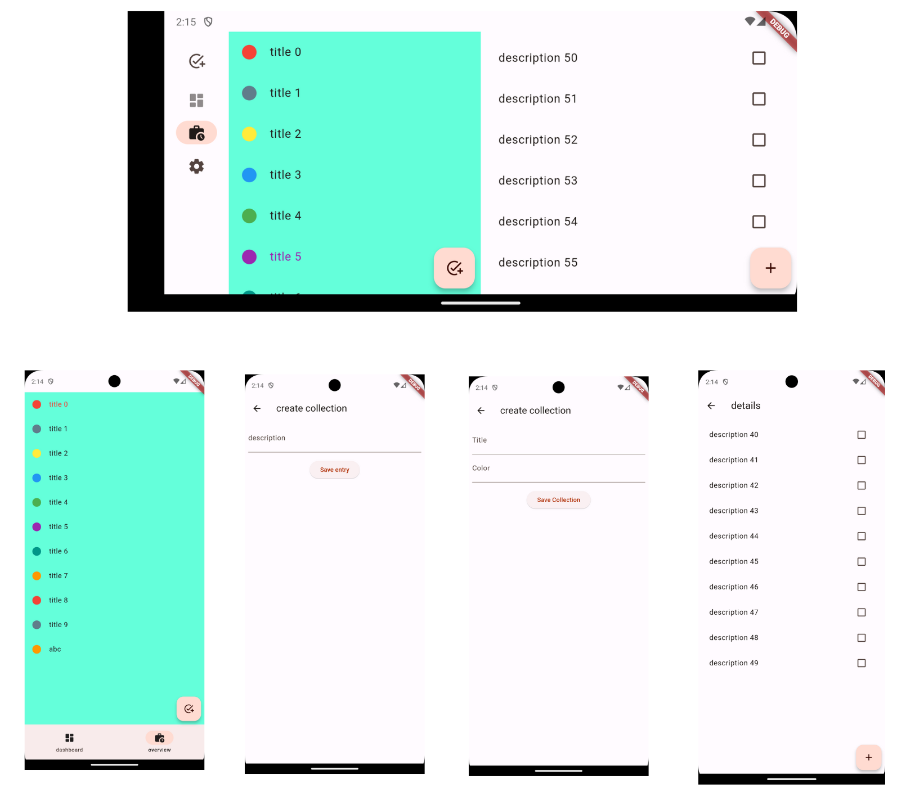

# TO_DO

this app is a simply todo create list. Which is build with clean architecture

## Screenshots

## Package Used

- Clean Architecture Design Pattern.
- Bloc(State management).
- adaptiveness(flutter_adaptive_scaffold).

## Features

- User can create todo with name and each todo has multiple lists.

#### Upcoming....
    1. All the CRUD operations will be created.
    2. Will be implementing freezed and retrofit Package.
    and many more...